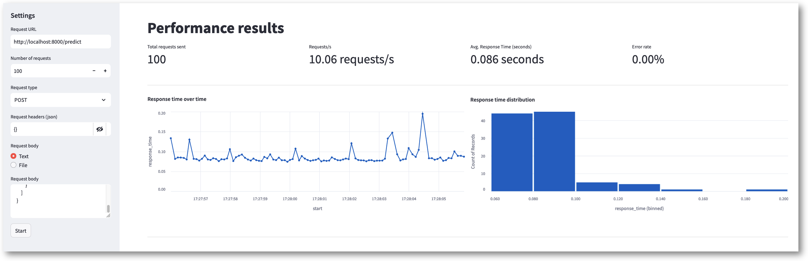

# API Performance Tester
Test endpoint performance from a simple dashboard.



## Usage
First, [install uv](https://docs.astral.sh/uv/getting-started/installation/).

Then, run the following command to start the dashboard:
```shell
uv run streamlit run src/api_performance_tester/app.py
```


Alternatively, you can run it via Docker:

```shell
docker build -t api-performance-tester .
docker run -p 8501:8501 api-performance-tester
```

Then connect to [http://localhost:8501](http://localhost:8501).

